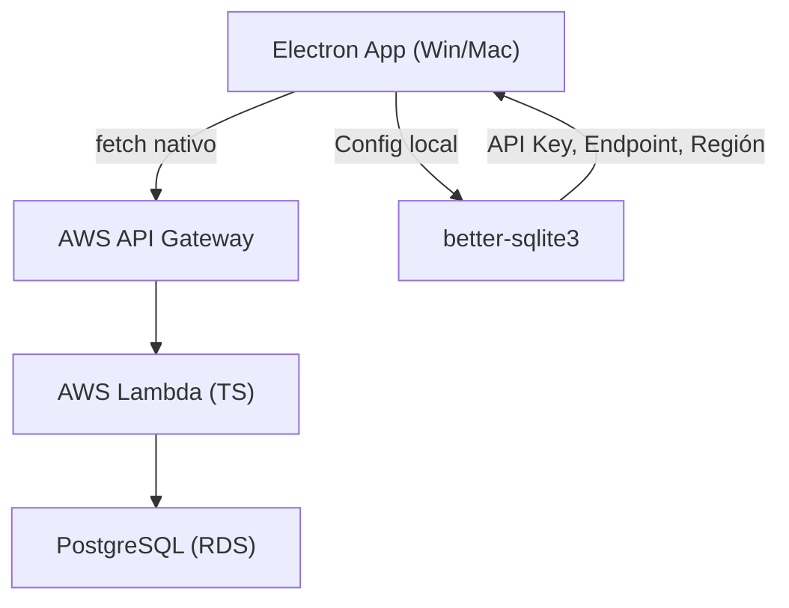

## 📋 Resumen del Proyecto

Aplicación de escritorio (Windows/Mac) para gestión de finanzas personales. Permite administrar múltiples cuentas bancarias, tarjetas de crédito/débito, préstamos, suscripciones, gastos por categoría y simulaciones financieras. Orientada a **consulta y toma de decisiones financieras**, no a automatización de registros.

---

## Consideraciones

La IA o modelos solo van a hacer el front-end, los humanos haran toda la configuracion
dentro de aws. Solo es necesario hacer el lambda que es el index.mjs y generar el 
aws-apigateway-swagger-v1.json de tal manera que pueda subir el json para generar el api
ya con la validacion del api activada para no activarla manualmente cada uno de los endpoints
y tambien validar el body y los headers

El font ya esta dentro del proyecto.

El desing esta en docs/DESING.md

Tienes que darme el sql solo para ejecutar en un archivo especifico

---

## 🏗️ Stack Tecnológico

| Capa | Tecnología | Notas |
| --- | --- | --- |
| **Desktop** | Electron | App multiplataforma Win/Mac |
| **Frontend** | React + TypeScript + Vite | SPA dentro de Electron |
| **Estilos** | CSS nativo | Sin frameworks CSS |
| **Gráficas** | Recharts | Única lib de visualización |
| **Íconos** | Lucide React | Ligera y tree-shakeable |
| **HTTP** | fetch nativo | Sin axios ni similares |
| **Config local** | better-sqlite3 | Solo para API key, endpoint y región |
| **Backend** | AWS API Gateway → Lambda (TS) | Monolito Lambda como backend |
| **Base de datos** | PostgreSQL (AWS RDS) | Toda la data financiera |
| **Moneda** | MXN (default) | Preparado para multi-moneda a futuro |

**Librerías totales del frontend:** React, ReactDOM, Vite, Recharts, Lucide React, better-sqlite3 (Electron main process). *Mínimo absoluto por seguridad.*

---

## 🏛️ Arquitectura General



### Flujo de datos

1. La app Electron guarda en **SQLite local** únicamente: API Key, endpoint del API Gateway y región AWS
2. Toda petición de datos va por **fetch nativo** al API Gateway
3. El Lambda (TypeScript) procesa la lógica de negocio y consulta/escribe en **PostgreSQL**
4. La respuesta regresa al frontend React para renderizar

---

## 🗄️ Esquema SQL Completo (PostgreSQL)

```sql
-- ============================================
-- ESQUEMA: app_gastos
-- App de Gestión de Gastos Personales
-- PostgreSQL 15+
-- ============================================

CREATE SCHEMA IF NOT EXISTS app_gastos;
SET search_path TO app_gastos;

-- ============================================
-- TABLA: currencies (preparado para multi-moneda)
-- ============================================
CREATE TABLE currencies (
    id          SERIAL PRIMARY KEY,
    code        VARCHAR(3) NOT NULL UNIQUE,       -- ISO 4217: MXN, USD, EUR
    name        VARCHAR(50) NOT NULL,
    symbol      VARCHAR(5) NOT NULL,              -- $, US$, €
    is_default  BOOLEAN NOT NULL DEFAULT FALSE,
    created_at  TIMESTAMPTZ NOT NULL DEFAULT NOW(),
    updated_at  TIMESTAMPTZ NOT NULL DEFAULT NOW()
);

INSERT INTO currencies (code, name, symbol, is_default)
VALUES ('MXN', 'Peso Mexicano', '$', TRUE);

-- ============================================
-- TABLA: banks (entidades bancarias)
-- ============================================
CREATE TABLE banks (
    id          SERIAL PRIMARY KEY,
    name        VARCHAR(100) NOT NULL,            -- Ej: BBVA, Banorte, Nu
    short_name  VARCHAR(20),
    color       VARCHAR(7),                       -- Hex color para UI
    icon_name   VARCHAR(50),                      -- Nombre del ícono Lucide
    is_active   BOOLEAN NOT NULL DEFAULT TRUE,
    created_at  TIMESTAMPTZ NOT NULL DEFAULT NOW(),
    updated_at  TIMESTAMPTZ NOT NULL DEFAULT NOW()
);

-- ============================================
-- TABLA: financial_instruments (TDC, TDD, cuenta)
-- ============================================
CREATE TABLE financial_instruments (
    id              SERIAL PRIMARY KEY,
    bank_id         INT NOT NULL REFERENCES banks(id),
    name            VARCHAR(100) NOT NULL,            -- Ej: "BBVA Oro", "Nu Débito"
    type            VARCHAR(20) NOT NULL              -- 'credit_card', 'debit_card', 'account'
                    CHECK (type IN ('credit_card', 'debit_card', 'account')),
    last_four       VARCHAR(4),                       -- Últimos 4 dígitos
    currency_id     INT NOT NULL REFERENCES currencies(id),

    -- Campos específicos para tarjeta de crédito
    credit_limit        NUMERIC(12,2),                -- Límite de crédito
    current_balance     NUMERIC(12,2) DEFAULT 0,      -- Saldo actual (deuda)
    available_credit    NUMERIC(12,2),                 -- Crédito disponible
    cut_off_day         INT CHECK (cut_off_day BETWEEN 1 AND 31),  -- Día de corte (fijo)
    payment_due_day     INT CHECK (payment_due_day BETWEEN 1 AND 31), -- Día de pago (default, modificable)
    annual_rate         NUMERIC(6,4),                 -- Tasa anual (para cálculos)

    -- Campos para cuentas de débito
    current_amount      NUMERIC(12,2) DEFAULT 0,      -- Saldo actual en cuenta

    is_active       BOOLEAN NOT NULL DEFAULT TRUE,
    notes           TEXT,
    created_at      TIMESTAMPTZ NOT NULL DEFAULT NOW(),
    updated_at      TIMESTAMPTZ NOT NULL DEFAULT NOW()
);

CREATE INDEX idx_instruments_bank ON financial_instruments(bank_id);
CREATE INDEX idx_instruments_type ON financial_instruments(type);

-- ============================================
-- TABLA: categories (categorías de gasto/ingreso)
-- ============================================
CREATE TABLE categories (
    id          SERIAL PRIMARY KEY,
    name        VARCHAR(100) NOT NULL,
    icon_name   VARCHAR(50),                      -- Ícono Lucide
    color       VARCHAR(7),                       -- Hex color
    type        VARCHAR(10) NOT NULL DEFAULT 'expense'
                CHECK (type IN ('expense', 'income', 'both')),
    is_system   BOOLEAN NOT NULL DEFAULT FALSE,   -- Categorías del sistema (no eliminables)
    is_active   BOOLEAN NOT NULL DEFAULT TRUE,
    created_at  TIMESTAMPTZ NOT NULL DEFAULT NOW(),
    updated_at  TIMESTAMPTZ NOT NULL DEFAULT NOW()
);

-- ============================================
-- TABLA: subcategories
-- ============================================
CREATE TABLE subcategories (
    id          SERIAL PRIMARY KEY,
    category_id INT NOT NULL REFERENCES categories(id),
    name        VARCHAR(100) NOT NULL,
    icon_name   VARCHAR(50),
    is_active   BOOLEAN NOT NULL DEFAULT TRUE,
    created_at  TIMESTAMPTZ NOT NULL DEFAULT NOW(),
    updated_at  TIMESTAMPTZ NOT NULL DEFAULT NOW(),
    UNIQUE(category_id, name)
);

CREATE INDEX idx_subcategories_category ON subcategories(category_id);

-- ============================================
-- TABLA: transactions (gastos e ingresos)
-- ============================================
CREATE TABLE transactions (
    id                  SERIAL PRIMARY KEY,
    instrument_id       INT NOT NULL REFERENCES financial_instruments(id),
    category_id         INT REFERENCES categories(id),
    subcategory_id      INT REFERENCES subcategories(id),
    currency_id         INT NOT NULL REFERENCES currencies(id),
    type                VARCHAR(10) NOT NULL
                        CHECK (type IN ('expense', 'income')),
    amount              NUMERIC(12,2) NOT NULL,
    description         VARCHAR(255),
    transaction_date    DATE NOT NULL,
    notes               TEXT,

    -- MSI (Meses Sin Intereses)
    is_msi              BOOLEAN NOT NULL DEFAULT FALSE,
    msi_months          INT,                          -- Total de meses (3, 6, 9, 12, 18, 24)
    msi_monthly_amount  NUMERIC(12,2),                -- Monto mensual calculado
    msi_start_date      DATE,                         -- Fecha inicio del cargo MSI
    msi_remaining       INT,                          -- Meses restantes

    created_at          TIMESTAMPTZ NOT NULL DEFAULT NOW(),
    updated_at          TIMESTAMPTZ NOT NULL DEFAULT NOW()
);

CREATE INDEX idx_transactions_instrument ON transactions(instrument_id);
CREATE INDEX idx_transactions_category ON transactions(category_id);
CREATE INDEX idx_transactions_date ON transactions(transaction_date);
CREATE INDEX idx_transactions_type ON transactions(type);
CREATE INDEX idx_transactions_msi ON transactions(is_msi) WHERE is_msi = TRUE;

-- ============================================
-- TABLA: loans (préstamos)
-- ============================================
CREATE TABLE loans (
    id                  SERIAL PRIMARY KEY,
    name                VARCHAR(150) NOT NULL,        -- Ej: "Préstamo auto Banorte"
    lender              VARCHAR(100),                 -- Empresa/banco que presta
    currency_id         INT NOT NULL REFERENCES currencies(id),
    original_amount     NUMERIC(12,2) NOT NULL,       -- Monto original
    remaining_amount    NUMERIC(12,2) NOT NULL,       -- Saldo pendiente
    annual_rate         NUMERIC(6,4),                 -- Tasa anual
    total_installments  INT NOT NULL,                 -- Total de pagos/cuotas
    paid_installments   INT NOT NULL DEFAULT 0,       -- Cuotas pagadas
    payment_type        VARCHAR(15) NOT NULL
                        CHECK (payment_type IN ('fixed', 'variable')),
                        -- fixed = pago estático mensual
                        -- variable = baja de acuerdo a tasa
    fixed_payment       NUMERIC(12,2),                -- Monto fijo mensual (si aplica)
    payment_day         INT CHECK (payment_day BETWEEN 1 AND 31),
    start_date          DATE NOT NULL,
    end_date            DATE,                         -- Fecha estimada de término
    instrument_id       INT REFERENCES financial_instruments(id), -- Desde dónde se paga
    notes               TEXT,
    is_active           BOOLEAN NOT NULL DEFAULT TRUE,
    created_at          TIMESTAMPTZ NOT NULL DEFAULT NOW(),
    updated_at          TIMESTAMPTZ NOT NULL DEFAULT NOW()
);

-- ============================================
-- TABLA: loan_payments (historial de pagos de préstamos)
-- ============================================
CREATE TABLE loan_payments (
    id              SERIAL PRIMARY KEY,
    loan_id         INT NOT NULL REFERENCES loans(id),
    installment_num INT NOT NULL,                     -- Número de cuota
    amount          NUMERIC(12,2) NOT NULL,
    principal       NUMERIC(12,2),                    -- Capital
    interest        NUMERIC(12,2),                    -- Interés
    payment_date    DATE NOT NULL,
    is_paid         BOOLEAN NOT NULL DEFAULT FALSE,
    paid_date       DATE,
    notes           TEXT,
    created_at      TIMESTAMPTZ NOT NULL DEFAULT NOW(),
    updated_at      TIMESTAMPTZ NOT NULL DEFAULT NOW()
);

CREATE INDEX idx_loan_payments_loan ON loan_payments(loan_id);

-- ============================================
-- TABLA: subscriptions (suscripciones recurrentes)
-- ============================================
CREATE TABLE subscriptions (
    id              SERIAL PRIMARY KEY,
    name            VARCHAR(150) NOT NULL,            -- Ej: Netflix, Spotify
    instrument_id   INT NOT NULL REFERENCES financial_instruments(id),
    category_id     INT REFERENCES categories(id),
    subcategory_id  INT REFERENCES subcategories(id),
    currency_id     INT NOT NULL REFERENCES currencies(id),
    amount          NUMERIC(12,2) NOT NULL,
    billing_cycle   VARCHAR(10) NOT NULL
                    CHECK (billing_cycle IN ('monthly', 'yearly', 'weekly')),
    billing_day     INT CHECK (billing_day BETWEEN 1 AND 31),
    next_billing    DATE,
    is_active       BOOLEAN NOT NULL DEFAULT TRUE,
    notes           TEXT,
    created_at      TIMESTAMPTZ NOT NULL DEFAULT NOW(),
    updated_at      TIMESTAMPTZ NOT NULL DEFAULT NOW()
);

CREATE INDEX idx_subscriptions_instrument ON subscriptions(instrument_id);

-- ============================================
-- TABLA: fixed_expenses (gastos fijos: renta, luz, agua, etc.)
-- ============================================
CREATE TABLE fixed_expenses (
    id              SERIAL PRIMARY KEY,
    name            VARCHAR(150) NOT NULL,            -- Ej: Renta, Luz CFE, Agua
    instrument_id   INT REFERENCES financial_instruments(id),
    category_id     INT REFERENCES categories(id),
    subcategory_id  INT REFERENCES subcategories(id),
    currency_id     INT NOT NULL REFERENCES currencies(id),
    estimated_amount NUMERIC(12,2) NOT NULL,          -- Monto estimado mensual
    is_variable     BOOLEAN NOT NULL DEFAULT FALSE,   -- true = varía cada mes (luz, agua)
    payment_day     INT CHECK (payment_day BETWEEN 1 AND 31),
    is_active       BOOLEAN NOT NULL DEFAULT TRUE,
    notes           TEXT,
    created_at      TIMESTAMPTZ NOT NULL DEFAULT NOW(),
    updated_at      TIMESTAMPTZ NOT NULL DEFAULT NOW()
);

-- ============================================
-- TABLA: fixed_expense_payments (historial de gastos fijos)
-- ============================================
CREATE TABLE fixed_expense_payments (
    id              SERIAL PRIMARY KEY,
    fixed_expense_id INT NOT NULL REFERENCES fixed_expenses(id),
    amount          NUMERIC(12,2) NOT NULL,
    period_month    INT NOT NULL CHECK (period_month BETWEEN 1 AND 12),
    period_year     INT NOT NULL,
    payment_date    DATE,
    is_paid         BOOLEAN NOT NULL DEFAULT FALSE,
    notes           TEXT,
    created_at      TIMESTAMPTZ NOT NULL DEFAULT NOW(),
    updated_at      TIMESTAMPTZ NOT NULL DEFAULT NOW(),
    UNIQUE(fixed_expense_id, period_month, period_year)
);

-- ============================================
-- TABLA: budgets (presupuestos mensuales por categoría)
-- ============================================
CREATE TABLE budgets (
    id              SERIAL PRIMARY KEY,
    category_id     INT REFERENCES categories(id),    -- NULL = presupuesto global
    currency_id     INT NOT NULL REFERENCES currencies(id),
    amount          NUMERIC(12,2) NOT NULL,
    month           INT NOT NULL CHECK (month BETWEEN 1 AND 12),
    year            INT NOT NULL,
    notes           TEXT,
    created_at      TIMESTAMPTZ NOT NULL DEFAULT NOW(),
    updated_at      TIMESTAMPTZ NOT NULL DEFAULT NOW(),
    UNIQUE(category_id, month, year)
);

-- ============================================
-- TABLA: simulations (simulaciones "qué pasa si")
-- ============================================
CREATE TABLE simulations (
    id              SERIAL PRIMARY KEY,
    name            VARCHAR(150) NOT NULL,            -- Ej: "¿Puedo comprar MacBook?"
    description     TEXT,
    simulation_date DATE NOT NULL DEFAULT CURRENT_DATE,
    snapshot_json   JSONB NOT NULL,                   -- Estado financiero al momento
    result_json     JSONB NOT NULL,                   -- Resultado de la simulación
    is_favorable    BOOLEAN,                          -- true = sí alcanza, false = negativo
    created_at      TIMESTAMPTZ NOT NULL DEFAULT NOW()
);

-- ============================================
-- TABLA: reminders (recordatorios / alertas internas)
-- ============================================
CREATE TABLE reminders (
    id              SERIAL PRIMARY KEY,
    title           VARCHAR(200) NOT NULL,
    description     TEXT,
    reminder_date   DATE NOT NULL,
    type            VARCHAR(20) NOT NULL
                    CHECK (type IN ('payment', 'cutoff', 'subscription', 'loan', 'custom')),
    reference_id    INT,                              -- ID de la entidad relacionada
    reference_type  VARCHAR(30),                      -- 'instrument', 'loan', 'subscription', etc.
    is_read         BOOLEAN NOT NULL DEFAULT FALSE,
    is_dismissed    BOOLEAN NOT NULL DEFAULT FALSE,
    created_at      TIMESTAMPTZ NOT NULL DEFAULT NOW(),
    updated_at      TIMESTAMPTZ NOT NULL DEFAULT NOW()
);

CREATE INDEX idx_reminders_date ON reminders(reminder_date);
CREATE INDEX idx_reminders_read ON reminders(is_read) WHERE is_read = FALSE;

-- ============================================
-- TABLA: credit_card_statements (estados de cuenta TDC)
-- ============================================
CREATE TABLE credit_card_statements (
    id              SERIAL PRIMARY KEY,
    instrument_id   INT NOT NULL REFERENCES financial_instruments(id),
    cut_off_date    DATE NOT NULL,
    payment_due_date DATE NOT NULL,                   -- Modificable por el usuario
    total_amount    NUMERIC(12,2) NOT NULL,           -- Total a pagar
    minimum_payment NUMERIC(12,2),
    no_interest_payment NUMERIC(12,2),                -- Pago para no generar intereses
    is_paid         BOOLEAN NOT NULL DEFAULT FALSE,
    paid_amount     NUMERIC(12,2),
    paid_date       DATE,
    created_at      TIMESTAMPTZ NOT NULL DEFAULT NOW(),
    updated_at      TIMESTAMPTZ NOT NULL DEFAULT NOW(),
    UNIQUE(instrument_id, cut_off_date)
);

-- ============================================
-- TABLA: transfers (pagos a TDC, transferencias entre cuentas)
-- ============================================
CREATE TABLE transfers (
    id                      SERIAL PRIMARY KEY,
    source_instrument_id    INT NOT NULL REFERENCES financial_instruments(id),
    destination_instrument_id INT NOT NULL REFERENCES financial_instruments(id),
    amount                  NUMERIC(12,2) NOT NULL,
    currency_id             INT NOT NULL REFERENCES currencies(id),
    transfer_date           DATE NOT NULL,
    type                    VARCHAR(20) NOT NULL
                            CHECK (type IN ('card_payment', 'inter_account', 'loan_payment', 'other')),
    statement_id            INT REFERENCES credit_card_statements(id), -- Pago vinculado a estado de cuenta
    loan_id                 INT REFERENCES loans(id),                  -- Pago vinculado a préstamo
    description             VARCHAR(255),
    notes                   TEXT,
    created_at              TIMESTAMPTZ NOT NULL DEFAULT NOW(),
    updated_at              TIMESTAMPTZ NOT NULL DEFAULT NOW(),
    CHECK (source_instrument_id != destination_instrument_id)
);

CREATE INDEX idx_transfers_source ON transfers(source_instrument_id);
CREATE INDEX idx_transfers_destination ON transfers(destination_instrument_id);
CREATE INDEX idx_transfers_date ON transfers(transfer_date);
CREATE INDEX idx_transfers_type ON transfers(type);

-- ============================================
-- VISTAS ÚTILES
-- ============================================

-- Vista: Resumen financiero general
CREATE OR REPLACE VIEW v_financial_summary AS
SELECT
    COALESCE(SUM(CASE WHEN fi.type = 'account' OR fi.type = 'debit_card'
        THEN fi.current_amount ELSE 0 END), 0) AS total_available,
    COALESCE(SUM(CASE WHEN fi.type = 'credit_card'
        THEN fi.current_balance ELSE 0 END), 0) AS total_credit_debt,
    COALESCE((SELECT SUM(remaining_amount) FROM loans WHERE is_active = TRUE), 0) AS total_loan_debt,
    COALESCE(SUM(CASE WHEN fi.type = 'credit_card'
        THEN fi.available_credit ELSE 0 END), 0) AS total_available_credit
FROM financial_instruments fi
WHERE fi.is_active = TRUE;

-- Vista: Gastos del mes actual por categoría
CREATE OR REPLACE VIEW v_monthly_expenses_by_category AS
SELECT
    c.name AS category,
    sc.name AS subcategory,
    SUM(t.amount) AS total,
    COUNT(*) AS num_transactions,
    DATE_TRUNC('month', t.transaction_date) AS month
FROM transactions t
LEFT JOIN categories c ON t.category_id = c.id
LEFT JOIN subcategories sc ON t.subcategory_id = sc.id
WHERE t.type = 'expense'
GROUP BY c.name, sc.name, DATE_TRUNC('month', t.transaction_date)
ORDER BY total DESC;

-- ============================================
-- CATEGORÍAS INICIALES (seed)
-- ============================================
INSERT INTO categories (name, icon_name, type, is_system) VALUES
('Vivienda', 'Home', 'expense', TRUE),
('Alimentación', 'UtensilsCrossed', 'expense', TRUE),
('Transporte', 'Car', 'expense', TRUE),
('Entretenimiento', 'Gamepad2', 'expense', TRUE),
('Salud', 'HeartPulse', 'expense', TRUE),
('Educación', 'GraduationCap', 'expense', TRUE),
('Servicios', 'Zap', 'expense', TRUE),
('Suscripciones', 'Repeat', 'expense', TRUE),
('Ropa', 'Shirt', 'expense', TRUE),
('Tecnología', 'Laptop', 'expense', TRUE),
('Préstamos', 'Landmark', 'expense', TRUE),
('Otros gastos', 'MoreHorizontal', 'expense', TRUE),
('Salario', 'Banknote', 'income', TRUE),
('Freelance', 'Briefcase', 'income', TRUE),
('Otros ingresos', 'PiggyBank', 'income', TRUE);

INSERT INTO subcategories (category_id, name) VALUES
((SELECT id FROM categories WHERE name = 'Vivienda'), 'Renta'),
((SELECT id FROM categories WHERE name = 'Vivienda'), 'Luz'),
((SELECT id FROM categories WHERE name = 'Vivienda'), 'Agua'),
((SELECT id FROM categories WHERE name = 'Vivienda'), 'Gas'),
((SELECT id FROM categories WHERE name = 'Vivienda'), 'Internet'),
((SELECT id FROM categories WHERE name = 'Entretenimiento'), 'Netflix'),
((SELECT id FROM categories WHERE name = 'Entretenimiento'), 'Spotify'),
((SELECT id FROM categories WHERE name = 'Entretenimiento'), 'Gaming'),
((SELECT id FROM categories WHERE name = 'Entretenimiento'), 'Cine'),
((SELECT id FROM categories WHERE name = 'Tecnología'), 'Software'),
((SELECT id FROM categories WHERE name = 'Tecnología'), 'Hardware'),
((SELECT id FROM categories WHERE name = 'Tecnología'), 'Gadgets');

-- ============================================
-- FUNCIONES ÚTILES
-- ============================================

-- Función: Calcular cuota MSI
CREATE OR REPLACE FUNCTION fn_calculate_msi(
    p_total NUMERIC,
    p_months INT
) RETURNS NUMERIC AS $$
BEGIN
    RETURN ROUND(p_total / p_months, 2);
END;
$$ LANGUAGE plpgsql IMMUTABLE;

-- Función: Generar tabla de amortización (préstamo fijo)
CREATE OR REPLACE FUNCTION fn_generate_loan_schedule(
    p_loan_id INT
) RETURNS VOID AS $$
DECLARE
    v_loan RECORD;
    v_monthly_rate NUMERIC;
    v_remaining NUMERIC;
    v_payment NUMERIC;
    v_principal NUMERIC;
    v_interest NUMERIC;
    v_date DATE;
BEGIN
    SELECT * INTO v_loan FROM loans WHERE id = p_loan_id;

    IF v_loan.payment_type = 'fixed' THEN
        FOR i IN 1..v_loan.total_installments LOOP
            v_date := v_loan.start_date + (i * INTERVAL '1 month');
            INSERT INTO loan_payments (loan_id, installment_num, amount, payment_date)
            VALUES (p_loan_id, i, v_loan.fixed_payment, v_date);
        END LOOP;
    ELSE
        v_monthly_rate := v_loan.annual_rate / 12;
        v_remaining := v_loan.original_amount;
        FOR i IN 1..v_loan.total_installments LOOP
            v_interest := ROUND(v_remaining * v_monthly_rate, 2);
            v_payment := ROUND(
                v_loan.original_amount *
                (v_monthly_rate * POWER(1 + v_monthly_rate, v_loan.total_installments)) /
                (POWER(1 + v_monthly_rate, v_loan.total_installments) - 1)
            , 2);
            v_principal := v_payment - v_interest;
            v_remaining := v_remaining - v_principal;
            v_date := v_loan.start_date + (i * INTERVAL '1 month');

            INSERT INTO loan_payments (loan_id, installment_num, amount, principal, interest, payment_date)
            VALUES (p_loan_id, i, v_payment, v_principal, v_interest, v_date);
        END LOOP;
    END IF;
END;
$$ LANGUAGE plpgsql;

-- Función: Verificar si categoría puede eliminarse
CREATE OR REPLACE FUNCTION fn_can_delete_category(p_category_id INT)
RETURNS BOOLEAN AS $$
BEGIN
    RETURN NOT EXISTS (
        SELECT 1 FROM transactions WHERE category_id = p_category_id
        UNION ALL
        SELECT 1 FROM subscriptions WHERE category_id = p_category_id
        UNION ALL
        SELECT 1 FROM fixed_expenses WHERE category_id = p_category_id
    ) AND NOT (SELECT is_system FROM categories WHERE id = p_category_id);
END;
$$ LANGUAGE plpgsql;
```

---

## 📐 Arquitectura del Frontend (Electron + React)

### Estructura de carpetas propuesta

```
finance-app/
├── electron/
│   ├── main.ts                  # Electron main process
│   ├── preload.ts               # Bridge seguro main↔renderer
│   └── local-db.ts              # better-sqlite3 (config local)
├── src/
│   ├── main.tsx                 # Entry point React
│   ├── App.tsx                  # Router principal
│   ├── api/
│   │   ├── client.ts            # Wrapper fetch nativo + API key
│   │   └── endpoints.ts         # Definición de endpoints Lambda
│   ├── components/
│   │   ├── ui/                  # Componentes genéricos (Button, Modal, Input, Card)
│   │   ├── charts/              # Wrappers de Recharts
│   │   └── layout/              # Sidebar, Header, MainContent
│   ├── pages/
│   │   ├── Dashboard.tsx
│   │   ├── Banks.tsx
│   │   ├── Instruments.tsx
│   │   ├── Transactions.tsx
│   │   ├── CreditCards.tsx
│   │   ├── Loans.tsx
│   │   ├── Subscriptions.tsx
│   │   ├── FixedExpenses.tsx
│   │   ├── Categories.tsx
│   │   ├── Budgets.tsx
│   │   ├── Simulator.tsx
│   │   ├── Reminders.tsx
│   │   └── Settings.tsx
│   ├── hooks/                   # Custom hooks (useFetch, useLocalConfig)
│   ├── types/                   # Tipos TypeScript compartidos
│   ├── utils/                   # Helpers (formatCurrency, dateUtils)
│   └── styles/
│       ├── global.css
│       ├── variables.css         # CSS custom properties (tema)
│       └── pages/               # CSS por página
├── package.json
├── vite.config.ts
├── tsconfig.json
└── electron-builder.json
```

---

## 📦 Arquitectura del Backend (AWS Lambda)

Lambda única de .mjs con conexión a la dB de postgreSQL

### Estructura propuesta

---

## 🗺️ Plan de Trabajo por Fases

### Fase 0 — Setup e Infraestructura

- [ ]  Inicializar proyecto Electron + React + Vite + TypeScript
- [ ]  Configurar CSS nativo con variables de tema oscuro
- [ ]  Configurar better-sqlite3 en main process para config local
- [ ]  Crear preload bridge seguro (contextBridge)
- [ ]  Pantalla de Settings: captura de API Key, endpoint y región
- [ ]  Configurar proyecto Lambda en AWS (API Gateway + Lambda + RDS PostgreSQL)
- [ ]  Ejecutar esquema SQL completo en RDS
- [ ]  Crear `api/client.ts` con fetch wrapper (headers, API key, error handling)
- [ ]  crear código de lambda
- [ ]  Middleware de autenticación por API key

### Fase 1 — Módulo Bancos e Instrumentos Financieros

- [ ]  **Backend:** CRUD bancos (`POST/GET/PUT/DELETE /banks`)
- [ ]  **Backend:** CRUD instrumentos financieros (`/instruments`)
- [ ]  **Frontend:** Página de Bancos — listado, crear, editar, eliminar
- [ ]  **Frontend:** Página de Instrumentos — alta de TDC, TDD, cuentas por banco
- [ ]  **Frontend:** Detalle de TDC con fecha de corte, pago, límite, saldo
- [ ]  **Frontend:** Vista agrupada por banco con todos sus instrumentos

### Fase 2 — Módulo Categorías y Subcategorías

- [ ]  **Backend:** CRUD categorías con validación de eliminación (fn_can_delete_category)
- [ ]  **Backend:** CRUD subcategorías
- [ ]  **Frontend:** Página de Categorías — CRUD con íconos Lucide y colores
- [ ]  **Frontend:** Subcategorías anidadas dentro de cada categoría
- [ ]  **Frontend:** Indicador visual de categorías no eliminables (asociadas a gastos)

### Fase 3 — Módulo Transacciones (Gastos e Ingresos)

- [ ]  **Backend:** CRUD transacciones con filtros (fecha, categoría, instrumento, tipo)
- [ ]  **Backend:** Lógica MSI — cálculo automático de monto mensual y fechas
- [ ]  **Backend:** Al crear transacción, actualizar saldo del instrumento
- [ ]  **Frontend:** Página de Transacciones — listado con filtros y búsqueda
- [ ]  **Frontend:** Formulario de nueva transacción con selector de instrumento y categoría
- [ ]  **Frontend:** Opción MSI en formulario de gasto a TDC (3, 6, 9, 12, 18, 24 meses)
- [ ]  **Frontend:** Vista de compras MSI activas con desglose por mes

### Fase 4 — Módulo Tarjetas de Crédito (Estados de Cuenta + Pagos/Transferencias)

- [ ]  **Backend:** CRUD estados de cuenta TDC
- [ ]  **Backend:** Cálculo automático del total por período de corte
- [ ]  **Backend:** CRUD transferencias (`/transfers`) con actualización automática de saldos en ambos instrumentos
- [ ]  **Backend:** Tipos de transferencia: `card_payment`, `inter_account`, `loan_payment`, `other`
- [ ]  **Backend:** Vinculación opcional de transferencia a estado de cuenta (`statement_id`) o préstamo (`loan_id`)
- [ ]  **Frontend:** Página de TDC — vista por tarjeta con período actual
- [ ]  **Frontend:** Detalle de estado de cuenta con desglose de movimientos
- [ ]  **Frontend:** Edición de fecha de pago (override del default)
- [ ]  **Frontend:** Indicadores de crédito disponible y deuda total
- [ ]  **Frontend:** Botón/formulario de "Abonar a tarjeta" desde cualquier cuenta/débito
- [ ]  **Frontend:** Sección de transferencias entre cuentas propias
- [ ]  **Frontend:** Historial de pagos/abonos por instrumento

### Fase 5 — Módulo Préstamos

- [ ]  **Backend:** CRUD préstamos
- [ ]  **Backend:** Generación de tabla de amortización (fija y variable)
- [ ]  **Backend:** Registro de pagos realizados
- [ ]  **Frontend:** Página de Préstamos — listado con progreso de pago
- [ ]  **Frontend:** Detalle de préstamo con tabla de amortización completa
- [ ]  **Frontend:** Configuración de tipo de pago (fijo vs variable con tasa)
- [ ]  **Frontend:** Registro de pago de cuota

### Fase 6 — Módulo Suscripciones y Gastos Fijos

- [ ]  **Backend:** CRUD suscripciones
- [ ]  **Backend:** CRUD gastos fijos + historial de pagos
- [ ]  **Frontend:** Página de Suscripciones — listado con montos y ciclos
- [ ]  **Frontend:** Página de Gastos Fijos — renta, luz, agua, etc.
- [ ]  **Frontend:** Registro de pago mensual de gastos fijos

### Fase 7 — Dashboard Principal

- [ ]  **Backend:** Endpoints de resumen financiero (vista v_financial_summary)
- [ ]  **Backend:** Endpoints de agregados para gráficas
- [ ]  **Frontend:** Dashboard con cards de resumen:
    - Dinero disponible total (todas las cuentas)
    - Deuda total en TDC
    - Deuda total en préstamos
    - Crédito disponible total
    - Balance neto (disponible − deudas)
- [ ]  **Gráfica:** Gasto por categoría (Pie chart — Recharts)
- [ ]  **Gráfica:** Flujo de efectivo mensual — ingresos vs egresos (Bar chart)
- [ ]  **Gráfica:** Evolución de saldo por cuenta (Line chart)
- [ ]  **Gráfica:** Proyección de gastos futuros (Area chart)

### Fase 8 — Módulo Presupuestos y Simulador

- [ ]  **Backend:** CRUD presupuestos mensuales por categoría
- [ ]  **Backend:** Lógica de simulación financiera (snapshot + cálculo)
- [ ]  **Frontend:** Página de Presupuestos — definir topes por categoría y mes
- [ ]  **Frontend:** Indicador de progreso vs presupuesto
- [ ]  **Frontend:** Página de Simulador "¿Qué pasa si…?"
    - Input: monto, tipo (compra directa, MSI, préstamo, meses con intereses)
    - Output: cómo queda tu situación financiera después
    - Indicador verde/rojo de viabilidad
- [ ]  **Frontend:** Historial de simulaciones guardadas

### Fase 9 — Módulo Recordatorios

- [ ]  **Backend:** CRUD recordatorios
- [ ]  **Backend:** Endpoint de recordatorios pendientes (no leídos)
- [ ]  **Frontend:** Página/sección de Recordatorios con badges de no leídos
- [ ]  **Frontend:** Tipos de recordatorio: pago TDC, corte, suscripción, préstamo, custom
- [ ]  **Frontend:** Marcar como leído/descartado

### Fase 10 — Pulido, Testing y Build

- [ ]  Revisión completa de flujos y edge cases
- [ ]  Manejo de errores global (frontend + backend)
- [ ]  Loading states y empty states en todas las páginas
- [ ]  Responsive dentro de la ventana Electron
- [ ]  Build de Electron para Windows (.exe) y Mac (.dmg)
- [ ]  Documentación de endpoints API
- [ ]  README del proyecto

---

## 📌 Decisiones Técnicas Clave

1. **API Key como auth** — Sencillo para single-user. Se almacena en SQLite local y se envía en header `x-api-key` en cada request.
2. **Un solo Lambda** — Monolito Lambda con router interno. Más simple que múltiples Lambdas para este scope.
3. **PostgreSQL en RDS** — Relacional, robusto, ideal para datos financieros con integridad referencial.
4. **MSI como campo en transactions** — No como tabla separada. Cada transacción MSI tiene sus campos de desglose.
5. **Simulaciones con snapshot** — Se guarda el estado financiero al momento de la simulación en JSONB para poder revisarlo después.
6. **Categorías protegidas** — Función SQL `fn_can_delete_category` garantiza que no se borren categorías en uso.
7. **Transfers independientes de transacciones** — Los pagos a TDC y movimientos entre cuentas son `transfers`, no `transactions`. Esto permite que el pago de una tarjeta sea independiente de las compras (contado, MSI, MCI). El usuario puede hacer abonos parciales, totales o adelantados a cualquier TDC en cualquier momento.